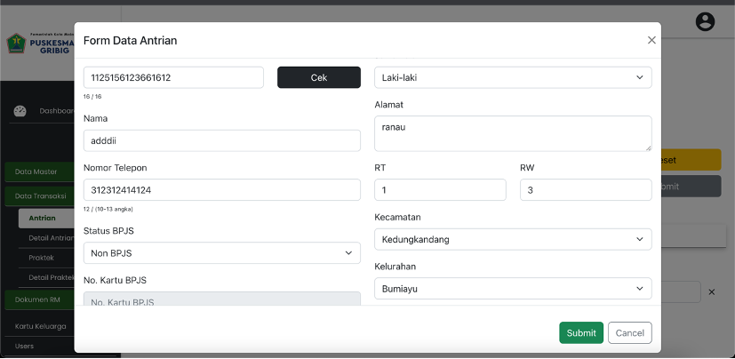
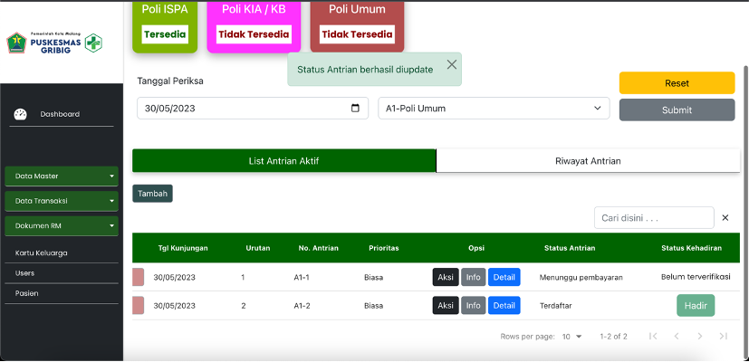
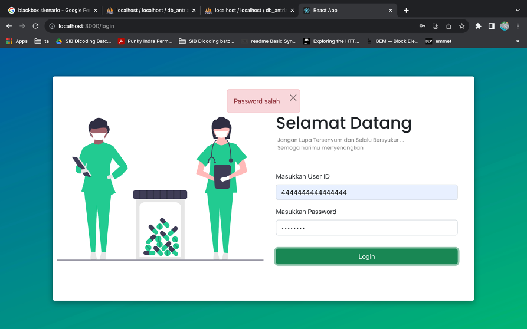
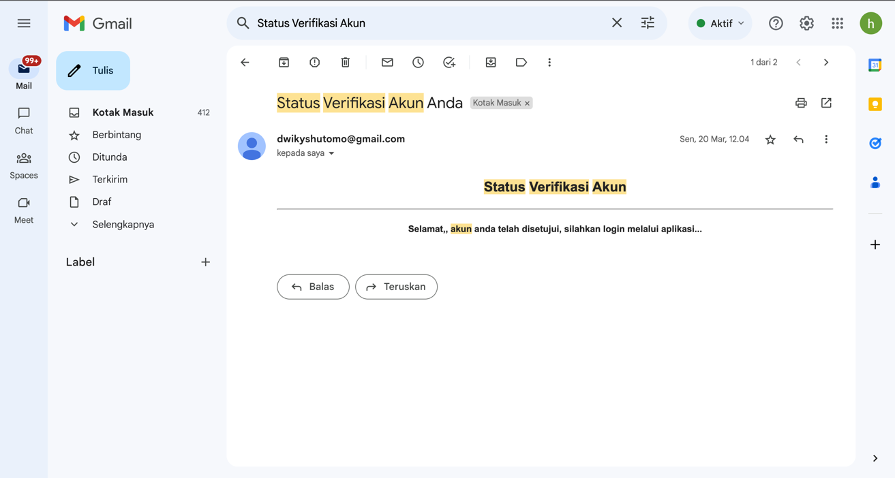

<h1 align="center">EQ-Puskesmas</h1>

  

<h3 align="center">
  Web EQ-Puskesmas
</h3>

## Contents

- [Introduction](#introduction)
- [Features](#features)
- [Requirements](#requirements)

- [Usage](#usage-for-development)
- [Screenshots](#screenshots)

- [Contributors](#contributor)

## Introduction
Apliaksi Antrian puskemas secara realtime. Pada user pasien menggunakan mobile, sedangkan petugas dan admin menggunakan web dan juga mobile.

## Features
1. Pendaftaran antrian realtime
2. Kelola data master 
3. Generate QR Code
4. pemanggilan pasien
4. Pemanfaatan nodemailer

## Requirements

1. Node_modules `npm install` or `yarn install`
2. [`react-native`](https://facebook.github.io/react-native/docs/getting-started)
3. `Google maps API Key` you can get it [here](https://developers.google.com/maps/documentation/javascript/get-api-key)

## Usage for development

1. Clone this Project 
2. Open app's directory in CMD or Terminal
3. Type `npm install` or `yarn install`
4. [Setup firebase Config](#setup-firebase-config)

6. Type `npm run start-dev` or `yarn run android` if you use yarn
7. Register your account
8. Login to use
9. Lets Chat!

## Setting Google Maps 
 
## Screenshots

  
  
  
  

## Contributor
© [Dwiky Satria Hutomo](https://github.com/dwikysahut 'Dwiky Satria Hutomo')
